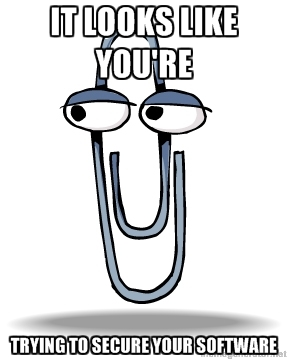

gradient: diagonal #5555dd #acacff
footer:
subfooter:
title: The State of Security in Ruby
author: Matt Glover

The State of Security in Ruby
=============================

<% left do %>
  
<% end %>

<% right do %>
  
<% end %>

Who Does This Guy Think He Is!?
===============================
He Is:

* Matt Glover
* Software engineer at [Mandiant](http://www.mandiant.com/)
* Interested in software security and secure coding concepts

He Is **NOT**:

* A security expert
* More qualified to speak about security than anyone else in the room
    * Even though he works at a security-focused company
    * He just has to worry about security a little more often

He Also Is:

* Looking to hire:
    * Test automation engineers and QA
    * Developers with a strong background in Ruby and/or JavaScript
    * Strong UI developers (HTML/CSS)

What Will Be Covered
====================

1. Recent Security Issues in the Ruby Ecosystem

2. Is Ruby Security A Mess?

3. What Can Be Done? - Practices, Tools, and Tips

Security Issues in Ruby
=======================
A rocky 12 months on the security front (primarily since the start of 2013)

* [55 CVEs mentioning Ruby](https://web.nvd.nist.gov/view/vuln/search-results?adv_search=true&cves=on&cve_id=&query=Ruby&cwe_id=&pub_date_start_month=4&pub_date_start_year=2012&pub_date_end_month=-1&pub_date_end_year=-1&mod_date_start_month=-1&mod_date_start_year=-1&mod_date_end_month=-1&mod_date_end_year=-1&cvss_sev_base=&cvss_av=&cvss_ac=&cvss_au=&cvss_c=&cvss_i=&cvss_a=):
    * MRI, JRuby, Rubinius, etc.
    * Rails, Devise, JSON, etc.
    * Various other gems large and small
* Rubygems compromise in January

Ruby Example
============
[Hash-flooding DoS vulnerability for ruby 1.9](http://www.ruby-lang.org/en/news/2012/11/09/ruby19-hashdos-cve-2012-5371/).

TL;DR - Replaces hashing algorithm to avoid predictable collisions leading to worst-case insert times.

Rails Example
=============
[3.2.11 Abitrary Code Execution via XML](http://weblog.rubyonrails.org/2013/1/8/Rails-3-2-11-3-1-10-3-0-19-and-2-3-15-have-been-released/)

TL;DR - Entity types, like YAML, were parsed in XML parameter hash construction. Now vulnerable types are not allowed.

Rubygems Website Example
========================
[Rubygems compromise in January](http://blog.rubygems.org/2013/01/31/data-verification.html)

TL;DR - Executed `Yaml.load` on gem metadata enabling code execution. Now whitelists classes demarshalled from gems.

CVEs in Other Gems
==================
A *non*-exhaustive list of other Ruby gem CVEs over the past year:

* [rack-cache (CVE-2012-2671)](https://web.nvd.nist.gov/view/vuln/detail?vulnId=CVE-2012-2671)
* [mail (CVE-2012-2140)](https://web.nvd.nist.gov/view/vuln/detail?vulnId=CVE-2012-2140)
* [authlogic (CVE-2012-6497)](https://web.nvd.nist.gov/view/vuln/detail?vulnId=CVE-2012-6497)
* [json (CVE-2013-0269)](https://web.nvd.nist.gov/view/vuln/detail?vulnId=CVE-2013-0269)
* [curl (CVE-2013-2617)](https://web.nvd.nist.gov/view/vuln/detail?vulnId=CVE-2013-2617)
* [nori (CVE-2013-0285)](https://web.nvd.nist.gov/view/vuln/detail?vulnId=CVE-2013-0285)
* [crack (CVE-2013-1800)](https://web.nvd.nist.gov/view/vuln/detail?vulnId=CVE-2013-1800)
* [httparty (CVE-2013-1801)](https://web.nvd.nist.gov/view/vuln/detail?vulnId=CVE-2013-1801)
* [extlib (CVE-2013-1802)](https://web.nvd.nist.gov/view/vuln/detail?vulnId=CVE-2013-1802)
* [multi_xml (CVE-2013-0175)](https://web.nvd.nist.gov/view/vuln/detail?vulnId=CVE-2013-0175)
* [devise (CVE-2013-0233)](https://web.nvd.nist.gov/view/vuln/detail?vulnId=CVE-2013-0233)
* [md2pdf (CVE-2013-1948)](https://web.nvd.nist.gov/view/vuln/detail?vulnId=CVE-2013-1948)

Security Vulnerability Impacts
==============================
Personal Rails Example (Scumbag Rails logo)
Tight Coupling (Plethora of stuff pulled in via Rails including ORM, mailer, web request stack)
Github Email Example

Why are we seeing this?
=======================
 - Popularity of Ruby
 - Popularity of major libraries like Rails
 - Increases/improvements in the software security research community
 - Things long known to be broken or questionable finally coming to relevance

Where are we at now?
 - A lot of low hanging fruit left?

How Does Ruby Stack Up?
=======================
Ruby v. Java
Ruby v. Other OSS (Apache, postgres, etc.)
Ruby v. Closed software

What Can You Do?
================

Accepting Reality
=================
Security breaches are inevitable (add exact Mandia quote)

Compare to the idea of bug-free code.

    :software_security == :software_quality

(Strictly speaking it is probably `:software_security >= :software_quality`)

Easy! Just Write Good Code!
===========================

Calibrating Risk
================

### 
VS.

Risk Management
===============
Detection, Defense, and Mitigation
Scaling security: Give examples of personal blog versus twitter. Personal blog versus small site that handles financials or health records versus amazon

Defense in Depth
================

Detection - Internal
====================
Detecting a compromise:
 - Logging/auditing
 - Monitoring and notifications
 - External reporters of compromise

Detecting vulnerabilities:
 - Smart Testing (including fuzzing)
   - Testing for security
 - Third parties?

Detection - External
====================
 - 3rd party code (gems)
 - Tracking 3rd party libs (infrastructure postgres, apache, etc.)
 - Problems with your hosting provider (Linode compromise)

Defense
=======
<% left do %>
Tools:

* brakeman
* metrics
* esapi

Practices:

* Helpful Practices (OWASP): Inline several of these
* Roll your own code (Flip Sasser*)
    * Possible security trade-off here
    * Know your likely attack cases
<% end %>
<% right do %>

<% end %>

*TODO: Add footnote about the fact that whatever quote I use is not an actual quote.*
*TODO: Go back and add images to the vulnerability slides*

Mitigation
==========
Recovery Strategy (backups, logging/auditing/scanning)
 - Ancillary benefits

- Helpful Practices (OWASP)

What We Can Do
==============
Community efforts that can help.
 - Open communication
 - Careful communication of issues you discover
Go back to rubygems-trust example.

Credits
=======
XKCD, Rails, etc.

https://commons.wikimedia.org/wiki/File:Image-Wikimania--5_agosto--Broken_lock.png
https://commons.wikimedia.org/wiki/File:Ruby_logo.png

Any Questions?
==============
Email:
GPG Key:

CCs license
